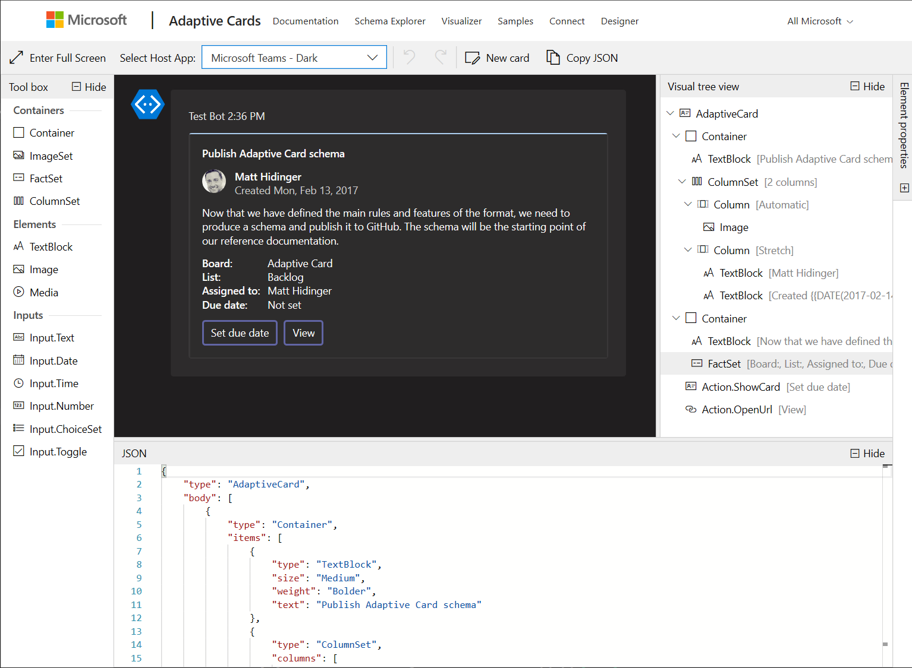

Since the 1.0 release of Adaptive Cards in March this year, the team has been hard at work on our 1.1 release, planning our 1.2 release and investigating the future of portable card and data formats for our 2.0 release.  Full release [here](https://github.com/Microsoft/AdaptiveCards/wiki/1.1-Feature-List)

At the Microsoft Ignite conference we announced the general availability of Adaptive Cards 1.1, unblocking some of the most requested community and partner feature such as a Media element, Action Icons and more layout flexibility. 

We’ve also been expanding our tooling to try and address feedback that designing a card with our current designer was complex – that’s why we’re also excited about the [new visual designer](https://aka.ms/adaptivedesigner) we announced at Ignite as well.  Now anyone can create an Adaptive Card through a simple drag and drop interface, opening up the format to designers, developers, and everyone in between.  And now with Adaptive Cards available in [Outlook as Actionable Messages](https://docs.microsoft.com/en-us/outlook/actionable-messages/adaptive-card), in [Cortana Skills](https://docs.microsoft.com/en-us/cortana/skills/adaptive-cards) and [Microsoft Teams](https://docs.microsoft.com/en-us/microsoftteams/platform/concepts/cards/cards-reference#adaptive-card) through the Azure Bot Service, you can find even more ways to unlock your content with Adaptive Cards!

