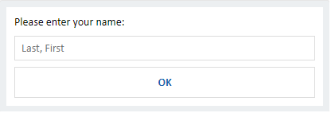
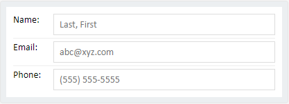
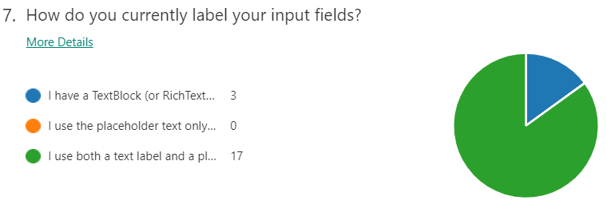

# Input/Label Associations

This document covers design considerations related to issue [#203](https://github.com/microsoft/AdaptiveCards/issues/203).

Consider the following card:
```json
{
	"type": "AdaptiveCard",
	"version": "1.0",
	"body": [
		{
			"type": "TextBlock",
			"text": "Please enter your name:"
		},
		{
			"type": "Input.Text",
			"id": "nameInput",
 			"placeholder": "Last, First"
		}
	],
	"actions": [
		{
			"type": "Action.Submit",
			"title": "OK"
		}
	]
}
```



In that card, the label for the input is “Please enter your name:”, however the card renderer has no way to determine that this is the case. We’ve run into a few cases where this is an issue:
 - Accessibility: The input will be read by screen readers as “Last, First”, rather than “Please enter your name” making it more difficult for screen reader users to use the card. 

 - Validation indicators: As part of input validation, we are allowing card authors to mark inputs as optional or required. One way to indicate that visually would be to put an indicator next to the input’s label. This requires knowing which text is the label.

 - Interaction model: Many forms move focus to the input when the label is clicked/tapped on. We can’t support that behavior without knowing which label goes with which input.

 - Responsiveness: One direction for the future of cards involves re-flowing the layout of a card based on the size of the display. Knowing that a particular label goes with a particular input may help us ensure that semantically related elements stay together on reflow.

## Basic Label Support in Adaptive Cards

The basic addition that we are going to make to the schema is to add a "labelFor" property to TextBlock and RichTextBlock elements. This approach provides a simple way to label inputs by providing an association between the elements while opting out of host formatting (for the label):

``` json
{
	"type": "AdaptiveCard",
	"version": "1.0",
	"body": [
		{
			"type": "TextBlock",
			"text": "Please enter your name:",
			"weight": "Bolder",
			"labelFor": "nameInput"
		},
		{
			"type": "Input.Text",
			"id": "nameInput",
			"placeholder": "Last, First"
		}
	],
	"actions": [
		{
			"type": "Action.Submit",
			"title": "OK"
		}
	]
}
``` 

## Formatting
The above approach provides a simple means by which to specify the label and to provide the ability to format the label as it keeps the format specified by the card author.

There is a concern, however, which must be balanced against the desire to provide card authors with the ability to format their labels. Hosts may have label formatting in their app which they want to apply consistently to cards they are displaying. This applies particularly to how they mark fields as required or optional (per spec at [InputValidation.md](https://github.com/microsoft/AdaptiveCards/blob/master/specs/DesignDiscussions/InputValidation.md)). While by default we will mark required inputs with a `*`, we may want to allow hosts more control. Perhaps some apps wish to show labels for required inputs in bold or italics. If we allows hosts to specify formatting based on what is required, however, and we allow authors to specify formatting via a TextBlock or RichTextBlock, we can easily run into cases where the formatting comes into conflict.

This conflict speaks to a general tension inherent in the design of Adaptive Cards. There's always going to be a trade off between giving the author more power, and letting the host control the experience for their users. We need to determine what balance we want to strike in this case.

In order to gather more data to help us balance the needs of the card authors and hosts, we sent a survey to customers who have expressed an interest in improving out input story. The following options are under consideration, and will be evaluated against survey data to determine which if any will be included in our v1 implementation.

The survey sent included 10 questions including the topics of input validation and input labels, for this spec we will only review the 4 questions that focus on the former topic. The results for this questions were used to leverage on some of the decisions taken on this spec document and can be found in the [Appendix](Appendix).

### Host Formatting

Based on the results from Q7 of the survey, we will add the option to allow the host to control formatting of the labels, either in general or for required inputs, we need a way for them to specify the desired format. There are two main things we may want to include:

#### Required and Optional indicators

> What do we expect to do here? Are we expecting authors to put their own required indicator? If so, then that's allowing authors to make bad cards, otherwise, the removal of styling must actually be performed for the indicator.

 By default, we will mark required inputs with a `*`. We may want, however, to provide the option for the host to configure a suffix to the label for required or optional inputs. This allows the host to add a `*` to required labels, or to add the words "required" or "optional". Consider a host config similar to the below:

  ```json
"inputLabelFormatting": 
{
	"requiredInputs": {
		"suffix":"*",
		"weight": "Bolder",
	},
	"optionalInputs": {
		"suffix":"(optional)",
		"isSubtle":true
	}
}
```
If we want even more detailed control, we could allow the host to specify something like `{labelName} (optional)` or `(optional) {labelName}` in order to allow them to position their indicators as they wish. We could make use of the common expression language being used for templating to support this functionality, but that would require taking a dependency on the common expression language implementation that would not otherwise be required for hosts not using templating.

> One concern with allowing hosts to specify arbitrary label templates or suffixes, is that it opens up a localization issue.  Whatever word they provide should be localized into the language of the card. If we introduce this functionality, we should make sure we have a localization story that covers this scenario. 

> When using these host properties, we would need to only apply them if all inputs on the card have labels so that required fields are marked consistently. We don't want to end up in a situation where some inputs in the card are marked as required in the label and others on the field itself, as this may lead to a confusing user experience.

##### Non-adjacent labels
We also have to note that this approach doesn’t require the label to be near the input it labels. In many cases, this may be confusing to users if use incorrectly by card authors. However, we should consider if there are valid scenarios for this use case. Possible scenarios that I could come up with include:



I built this card using a series of column sets. Although it is an acceptable UI, this is probably not the approach we want for card authors to label their inputs on the side. The card authoring is fairly non-intuitive to get a good result. If we want to support labels to the left of the input, we should probably do this as a first-class explicit property (```"labelPosition"``` or ```"allowHorizontalLabels"```). 

This card is another possible example of a use case for non-adjacent labels, where there is additional information between the label and the input:


>This scenario could be covered by a RichTextBlock that contains both pieces of text being used as the label (arguably the entire text should be read as the accessibility label for the input). Are there scenarios where we would want something else (an image?) between the label and the input?

## Backwards Compatibility

There is no negative impact on down-level platforms other than not providing the association. Because the TextBlock will still exist, only the association will be dropped when rendered on a platform that doesn't support this feature.

## Placeholders

Based on the answers from Q7, no users answered to using placeholders only for labeling their inputs. For v1 of this feature we decided to not modify placeholders.

## Label Position

Label position will be handled by the user in the aforementioned approach as no other change will be made to the structure of the adaptive card, the link is only logical so authors will continue to have control on where every element is drawn.

# Appendix

#### Survey results

#### Q6. How would you expect a user to know trhe difference between required and optional inputs?


Most of the voters are fine with using an asterisk next to the inputs or labels. The options under other vary from card authors "thinking an asterisk is a bit crude" or adding the asterisk by themselves.

#### Q7. How do you currently label your input fields?



Most of the voters use a text label and a placeholder for labeling their input text. The remaining voters only use a TextBlock on top of the input to label them. It's important to note that none of the voters only use placeholders for labeling.

#### Q8. If you use a TextBlock to label your input, how frequently do you change the default TextBlock style? (size, weight, color, etc.)


Most of the voters "Rarely" change the default style for TextBlocks that label their inputs. A thing to note here is that no voter commented that they never style the TextBlocks.

#### Q9. If you are a Host App that renders Adaptive Cards authored by others in your own app, how important to you is the ability to control the following?


This is the question where there's not a majority of voters who picked one option. People are very divisive on whether to have a reasonable default behavior and configuring the labels to keep consistency with other UI in their apps.  

#### AutomationProperties
 Xaml also has an AutomationProperties.LabeledBy attached property for accessibility purposes. This property is used by all elements (not just inputs). If you use it to mark a proceeding text block as the label, it is read the same as a header by narrator, but does not have the click to select behavior of header. 

 ```xml
<TextBlock x:Name="inputLabel">This is a text block label</TextBlock>
<TextBox AutomationProperties.LabeledBy="{Binding ElementName=inputLabel}"/> 
```
 

### HTML
#### Label
HTML has label tag which can be used to label inputs. The input can either be placed inside the label, or referenced with “for”:

``` HTML
  <label>
  Please enter your name:
  <input id="nameInput">
  </label>
```

Or
``` HTML
  <label for="nameInput"> Please enter your name:</label>
  <input id="nameInput">
```
 
This results in the label being associated with the input both for interactivity and accessibility.

#### Aria
 HTML also has aria-label and aria-labelledby. These properties are used for accessibility purposes. As in the Xaml AutomationProperties.LabeledBy property, this labels the input for accessibility purposes, but does not change the interactivity model: clicking on the label does not select the input.

 ## Accessibility Labels
Both Xaml and HTML have accessibility labels which can be used to address accessibility issues related to inputs (AutomationProperties and aria- properties respectively). In both cases, setting these properties addresses accessibility issues, but does not semantically associate the label with the input for interactivity behavior. Additionally, these properties are not input specific, and can be used on other elements as well as inputs. We should consider whether we want generic accessibility labels such as these, but such a feature should apply to all elements and is outside the scope of this document.
